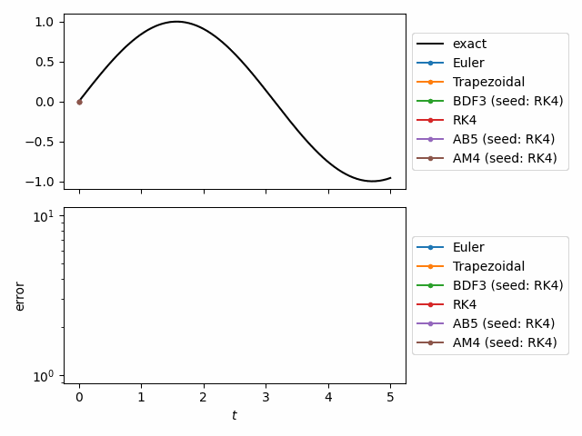
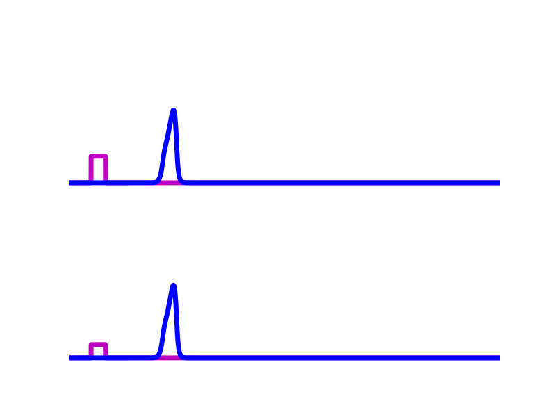

# odeiter
A Python package for time-integration of systems of differential equations using generators.

# Motivation
The elephant in the room is `scipy.integrate.sovle_ivp`.
Why would you use `odeiter` instead?
If you want an array of your solution at all time points in a finite interval
then `solve_ivp` is your best solution, but I found myself needing something
more flexible. So I made `odeiter` which takes advantage of Python generators.

Generators decouple the solver code from the looping body.
In general, you don't want to simply compute the soltuion to your system.
You want to compute the solution **and** do something with the solution.
For example, the following animation was made using `odeiter` and it
solves the system
$$
x''(t) = -x, \qquad x(0) = 0, \qquad x'(0) = 1
$$
using 6 different solvers, simultaineously. At each time step it
plots the solution, computes the relative erorr, and plots the relative error.



This can be done with `solve_ivp` but one would have to store the entire solution
for each solve in memory and *then* loop again to perform the plotting.
That doesn't sound so bad for a system with only two variables (since it's a second
order equation), but this becomes imensly important when you want to solve PDEs.

For example, I used `odeiter` to solve a neuralfield eqution on a bumpy-sphere.
A neural field equation is an integro-differential equation, so the resulting ODE
had hundreds of thousands of dimensions, one for each sample point on the surface.
At each time step, I plot the solution (left) and I also plot the maximum value
of the solution (right) as a continuous path across the surface.


Once a frame for the animation is generated, the solution at that time point
is no longer requried so it is discarded and the memory is freed. 

Another advantage, is that generators are lazy. They don't compute the solution until
you ask for it. This allows you to run simulations without a predetermined stoping
condition. For example, the flowing animation shows two simulations created with
`odeiter` where the difference is in the amplitudes of the forcing functions (magenta).



The top simulation entrains so the solution (blue) rides the forcing function (magenta)
indefinately, and achieves a stable traveling wave solution.
In the bottom simulation, the solution rides the forcing function for a while
but in the end it does not entrain because the forcing function is too weak.
I tested many amplitudes and simulated until either they reached a traveling pulse
solution or until the forcing term was separated from the solution by a certain distance.
I was able to implement this simply without needing to know how long I would simulate.


# Example

This example shows a standard example that plots the solution at each time 
step. This code requires `pyqt5` and `matplotlib` to function properly.
```
"""
Solve the second order equation
x'' = -x
x(0) = 0
x'(0) = 1

which has the solution
x(t) = sin(t)
"""
import matplotlib.pyplot as plt
import numpy as np
from odeiter import TimeDomain_Start_Stop_MaxSpacing, RK4

x0 = 0
y0 = 1
A = np.array(
    [
        [0, 1],
        [-1, 0],
    ]
)
u0 = np.array([x0, y0])


def rhs(t, u):
    return A @ u


def exact(t):  # exact solution for testing
    return np.sin(t)


t0, tf = 0, 2 * np.pi
max_time_step = 1e-2
# Create a TimeDomain object
time = TimeDomain_Start_Stop_MaxSpacing(t0, tf, max_time_step)
# Choose a solver
solver = RK4()
plt.ion()  # requires pyqt5 for interactive plotting
# Loop over the soluttion
for t, u in zip(time.array, solver.solution_generator(u0, rhs, time)):
    # do whatever you want with the solution
    x, y = u
    plt.plot(t, x, "k.")
    plt.pause(1e-3)
plt.show(block=True)
```
